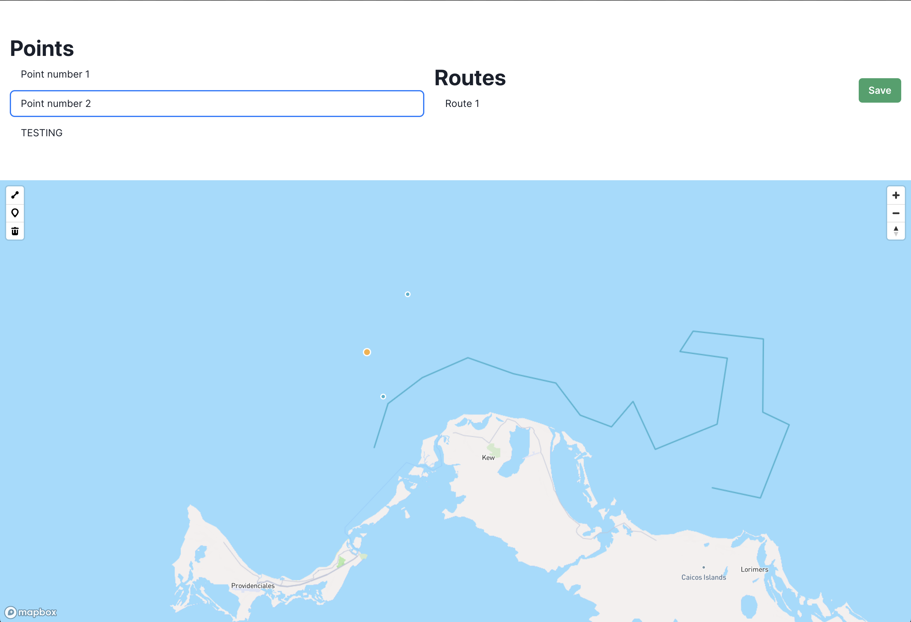

## Interactive Map Utility

Interactive map utility using `Mapbox` and `@mapbox/mapbox-gl-draw` that allows
creating and editing points and routes on a map with bidirectional state between
map elements and their corresponding point/route elements rendering in the DOM.

Live demo: [https://charter-map.vercel.app/](https://charter-map.vercel.app/)

